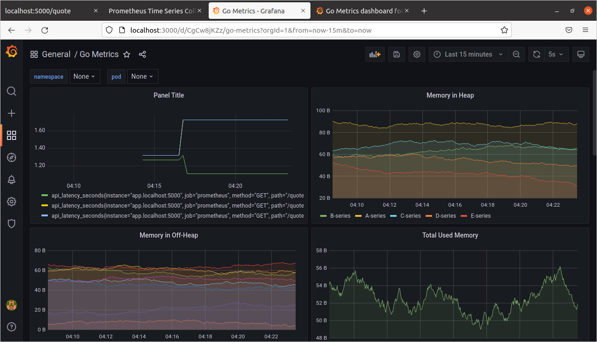

## Instrumenting a Go application 

### Tools used ⚙️
- Prometheus: for recording/scraping metrics from the application 
- Grafana: for visualizing the obtained metrics from the prometheus server 

### To run the application ⚡️
>NOTE: Docker and Docker compose are required.

1. Run the services (app, prometheus, grafana) using docker-compose - `docker-compose.yml` 
```bash
$ docker-compose up --build 
``` 

2. View the scraped metrics at `http://localhost:5000/metrics` 
3. Hit the quote endpoint at `http://localhost:5000/quote` to record the `api_latency_seconds` metric for that path.
4. Query the metrics on the prometheus server at `http://localhost:9090` 
5. Visualize the metrics on grafana at `http://localhost:3000`

>Grafana authentication details are available at `/grafana/grafana.ini`

## Voila! 🎉
Create your dashboard on Grafana, add the desired datasource (prometheus server), and PromQL queries to visualize the metrics.

